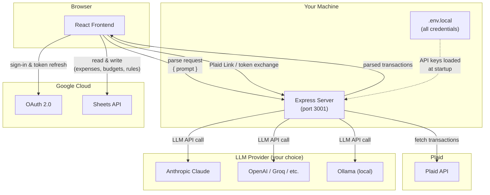

# Ledgr

A personal expense tracking app that connects to your bank accounts, parses PDF/text statements, and stores everything in your own Google Sheet. No third-party servers, no subscription — your data stays in your Google account.

## What it does

- **Bank Sync** — Connect real bank accounts via Plaid and import transactions directly
- **PDF Import** — Upload a bank statement PDF; an LLM extracts the transactions automatically
- **Paste Import** — Copy-paste transaction rows from your bank's website; the LLM parses them
- **Manual Entry** — Add individual expenses by hand
- **Merchant Memory** — Remembers category corrections you make and applies them automatically on future imports
- **Duplicate Detection** — Flags transactions that look like they already exist in your sheet
- **Payment Detection** — Identifies credit card payments and transfers so they aren't counted as real expenses; shows them highlighted and unchecked so you can decide
- **Edit & Delete** — Fix or remove any expense directly from the dashboard
- **Budgets** — Set monthly spending targets per category with visual progress bars
- **Trends** — 12-month heatmap table showing spending by category over time
- **Google Sheets backend** — All data is stored in a spreadsheet in your own Google account; export to CSV anytime from Sheets

---

## Architecture



**Key points:**
- The browser talks to Google directly (OAuth sign-in and Sheets read/write) — no middleman for your expense data
- All LLM calls and Plaid calls are proxied through the local Express server, so API keys never touch the browser
- `.env.local` is the single place for all credentials; it is gitignored

---

## Tech stack

| Layer | Technology |
|---|---|
| Frontend | React 19 + TypeScript + Vite |
| Styling | Tailwind CSS v4 |
| Storage | Google Sheets API (OAuth 2.0) |
| AI parsing | Any LLM via the Express server — Anthropic Claude by default; configurable to OpenAI, Groq, Ollama, or any OpenAI-compatible provider |
| Bank sync | Plaid Link + Plaid Transactions API |
| Server | Node.js + Express (port 3001) — handles LLM calls and Plaid |

---

## Prerequisites

- **Node.js** 18+ and npm
- A **Google account** (for Sheets storage and OAuth sign-in)
- An **LLM API key** for parsing — Anthropic Claude is the default ([console.anthropic.com](https://console.anthropic.com)), but any OpenAI-compatible provider works (see [Choosing an LLM](#choosing-an-llm))
- A **Plaid account** *(optional — only needed for bank sync)* — [dashboard.plaid.com](https://dashboard.plaid.com)

---

## Setup

### 1. Clone and install

```bash
git clone https://github.com/your-username/ledgr.git
cd ledgr
npm install
```

### 2. Google Cloud — OAuth & Sheets API

1. Go to [Google Cloud Console](https://console.cloud.google.com) and create a new project
2. Enable these two APIs:
   - **Google Sheets API**
   - **Google Identity Services** (enabled by default for OAuth)
3. Go to **APIs & Services → Credentials → Create Credentials → OAuth 2.0 Client ID**
   - Application type: **Web application**
   - Authorized JavaScript origins: `http://localhost:5173`
4. Copy the **Client ID** — you'll need it for `VITE_GOOGLE_CLIENT_ID`
5. Create a new **Google Sheet** in your Google Drive and copy the ID from its URL:
   ```
   https://docs.google.com/spreadsheets/d/THIS_IS_THE_ID/edit
   ```

### 3. Environment variables

Copy the example file and fill in your values:

```bash
cp .env.local.example .env.local
```

Edit `.env.local` with your credentials:

```env
# Google (required)
VITE_GOOGLE_CLIENT_ID=your-google-oauth-client-id.apps.googleusercontent.com
VITE_SPREADSHEET_ID=your-google-spreadsheet-id

# LLM for parsing (choose one — see "Choosing an LLM" below)
ANTHROPIC_API_KEY=sk-ant-api03-...

# Plaid (optional — only for bank sync)
PLAID_CLIENT_ID=your-plaid-client-id
PLAID_SECRET=your-plaid-secret-key
PLAID_ENV=sandbox
```

> **Note:** All API keys are server-side only — they live in `.env.local` (which is gitignored) and are read by the Express server. They are never bundled into the browser.

### 4. Run the app

```bash
npm run dev
```

This starts both the Vite frontend and the Express server together. Open [http://localhost:5173](http://localhost:5173).

### 5. First sign-in

1. Click **Sign in with Google**
2. The app automatically creates three sheets in your spreadsheet: `Expenses`, `MerchantRules`, `Budgets`
3. Start importing or adding expenses

---

## Choosing an LLM

LLM calls are routed through the local Express server, so any provider works regardless of browser CORS restrictions. Configure in `.env.local`:

**Anthropic Claude (default)**
```env
ANTHROPIC_API_KEY=sk-ant-api03-...
# Optionally pin a specific model (defaults to claude-haiku-4-5-20251001):
# LLM_MODEL=claude-opus-4-6
```

**OpenAI**
```env
LLM_BASE_URL=https://api.openai.com/v1
LLM_API_KEY=sk-...
LLM_MODEL=gpt-4o-mini
```

**Groq (free tier available)**
```env
LLM_BASE_URL=https://api.groq.com/openai/v1
LLM_API_KEY=gsk_...
LLM_MODEL=llama-3.1-8b-instant
```

**Ollama (local, no API key needed)**
```env
LLM_BASE_URL=http://localhost:11434/v1
LLM_MODEL=llama3.2
```

**Any other OpenAI-compatible provider**
```env
LLM_BASE_URL=https://your-provider.com/v1
LLM_API_KEY=your-key
LLM_MODEL=your-model-name
```

When `LLM_BASE_URL` is set, it takes priority over `ANTHROPIC_API_KEY`.

---

## Features in detail

### Expenses Dashboard

The main view. Shows all expenses in a filterable, sortable table with:
- Filters by date range, category, source, description, and amount
- Inline edit — click the edit icon on any row to change any field
- Inline delete — with a "Delete? Yes / No" confirmation in the row
- Sidebar widgets showing spending by category (current month or filtered), monthly totals, and yearly totals

### Add Manually

Simple form to log a single expense. Includes duplicate detection — warns if a very similar expense already exists.

### Paste Text

Paste raw transaction data copied from your bank's website (any format). The LLM identifies dates, amounts, and merchant names, assigns categories, and presents a review table. You can correct categories before importing; corrections are saved as merchant memory rules for next time.

Detected payment rows (credit card autopay, account transfers, etc.) are shown with a purple highlight and unchecked by default.

### Import Statement

Drag-and-drop or click to upload a bank statement PDF. Works with text-based PDFs (most bank exports). The LLM extracts transactions the same way as Paste Text.

### Bank Sync

Connect real bank accounts using Plaid Link. Fetches the last 7–90 days of transactions.

- Transactions are shown in a review table before import
- Duplicate and payment rows are auto-deselected
- Supports multiple banks simultaneously
- Remove a connected bank at any time

### Trends

A 12-month heatmap table. Rows are expense categories sorted by total spend; columns are months. Cell color intensity shows relative spending within each category. Useful for spotting seasonal patterns.

### Budgets

Set a monthly spending target for any category. Each row shows:
- Category name
- Amount spent this month
- Budget input field
- Progress bar (green under 80%, amber 80–99%, red at 100%+)

Budgets are saved to your Google Sheet.

### Merchant Memory

Every time you correct a category on an import, the merchant name is saved to the `MerchantRules` sheet. On future imports the rule is applied automatically — if you once changed "NFLX" to "OTT/Streaming Fees", it will pre-fill that category next time.

### Payment / Transfer Detection

Credit card payments, autopay, balance transfers, and inter-account transfers are flagged and shown:
- With a purple row background
- Labeled "payment?" next to the description
- Unchecked by default in the review table

You can still check and import them if you want to track them.

---

## Google Sheets structure

The app manages three sheets automatically:

| Sheet | Columns | Description |
|---|---|---|
| `Expenses` | ID, Date, Description, Amount, Category, Source, CreatedAt | All imported/added expenses |
| `MerchantRules` | Merchant, Category | Learned merchant → category mappings |
| `Budgets` | Category, MonthlyAmount | Per-category monthly budget targets |

You can add your own sheets, formulas, or charts alongside these — the app only reads/writes to these three tabs.

---

## Privacy

- Your expenses go directly from your browser to Google Sheets via the Google API — no third-party app server ever sees them
- The Express server (`server/index.ts`) runs locally on your machine and handles LLM parsing calls and Plaid bank sync
- LLM API keys never leave your machine — they are read from `.env.local` by the local server only
- Plaid access tokens are stored in `server/plaid-accounts.json` on your local machine (gitignored)
- The LLM provider you choose receives the text of your bank statements for parsing; no data is stored beyond standard API logging

---

## Running your own copy

This project is designed to be self-hosted per user. Each person needs their own:
- Google Cloud project + OAuth credentials
- Google Spreadsheet
- LLM API key (Anthropic, OpenAI, Groq, or self-hosted via Ollama)
- Plaid credentials (optional)

There is no shared backend.

---

## Security notes

- `.env.local` is gitignored — never commit it
- `server/plaid-accounts.json` is gitignored — it contains Plaid access tokens
- If you fork this repo, verify no credentials were accidentally committed: `git log -p`
