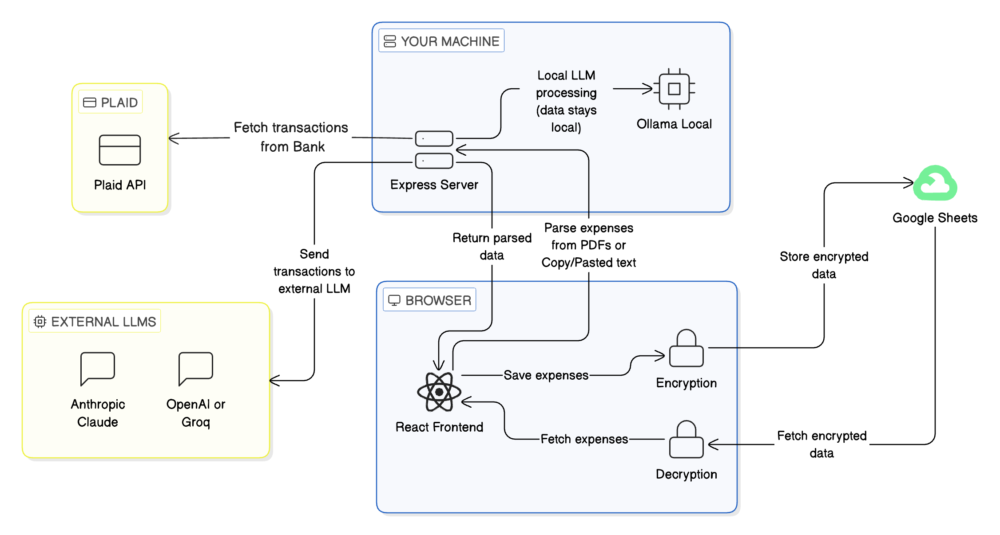

# Ledgr

## The Problem: Financial Fragmentation & Privacy Anxiety

Managing personal finances today usually feels like a trade-off between **convenience** and **privacy**. 

Most of us fall into one of two frustrated camps:

1. **The Spreadsheet Purist:** You manually copy-paste data into Excel or Google Sheets. It’s private and customizable, but it’s a soul-crushing chore that leads to "tracking burnout" and outdated data.
2. **The App Optimizer:** You use third-party "free" apps that sync with your bank. It’s convenient, but your most sensitive financial data is stored on their servers, sold to advertisers, or trapped behind a monthly subscription.

### Enter Ledgr

**Ledgr** was built to bridge this gap. It provides the "magic" of modern fintech—AI-powered parsing, automatic bank syncing, and beautiful visualizations—without ever taking ownership of your data.

## What it does

### 1. Expense Addition
- **Manual Entry** — Add individual expenses by hand for quick, on-the-go tracking.
- **Bank Sync** — Connect real bank accounts via Plaid to import transactions directly.
- **PDF Import** — Upload bank statement PDFs or any other PDFs with transactions; an LLM automatically extracts and formats the data.
- **Paste Import** — Copy-paste transaction rows from your bank's website for instant LLM parsing.
- **Duplicate Detection** — Intelligently flags transactions that already exist in your records to prevent double-counting.

### 2. Expense Tracking
- **Budgets** — Set monthly spending targets per category with real-time visual progress bars.
- **Trends** — View a 12-month heatmap table showing spending patterns by category over time.
- **Payment Detection** — Identifies credit card payments and transfers so they aren't counted as new expenses.
- **Merchant Memory** — Automatically learns and applies your category corrections to future imports.
- **Edit & Delete** — Maintain full control to fix or remove any expense directly from your dashboard.

### 3. How it Works

**You control where your data goes.** Unlike closed-loop apps, Ledgr is built on a foundation of data sovereignty. You decide exactly which systems see your financial data and how that data is shared, ensuring you are the owner of your financial story, not the product.

Your expenses are stored in Google Sheets, encrypted before they leave your local machine — so Google never sees your actual transactions. You can add expenses manually, paste copied text from your bank's website, or upload a PDF bank statement. For the paste and upload options, the raw text is sent to an LLM for parsing. If you use **Ollama** (a local LLM), the data never leaves your machine at all. If you choose a cloud LLM provider, that text is sent to their systems — do your own due diligence on their data retention policies. Finally, you can optionally connect **Plaid** to fetch transactions directly from your bank account.



---

## Tech stack

| Layer | Technology |
|---|---|
| Frontend | React 19 + TypeScript + Vite |
| Styling | Tailwind CSS v4 |
| Storage | Google Sheets API (OAuth 2.0) |
| Encryption | AES-256-GCM via browser Web Crypto API — key stored in `.env.local`, never sent anywhere |
| AI parsing | Any LLM via the Express server — configurable to Anthropic, OpenAI, Groq, Ollama, or any OpenAI-compatible provider |
| Bank sync | Plaid Link + Plaid Transactions API |
| Server | Node.js + Express (port 3001) — handles LLM calls and Plaid |

---

## Prerequisites

- **Node.js** 18+ and npm
- A **Google account** (for Sheets storage and OAuth sign-in)
- An **LLM API key** for parsing — any OpenAI-compatible provider works (Anthropic, OpenAI, Groq, etc.) or run Ollama locally for free (see [LLM for parsing](#3-llm-for-parsing-required))
- A **Plaid account** *(optional — only needed for bank sync)* — [dashboard.plaid.com](https://dashboard.plaid.com)

---

## Setup

### 1. Clone and install

```bash
git clone https://github.com/your-username/ledgr.git
cd ledgr
npm install
```

### 2. Google Cloud — OAuth & Sheets API

1. Go to [Google Cloud Console](https://console.cloud.google.com) and create a new project
2. Enable these two APIs:
   - **Google Sheets API**
   - **Google Identity Services** (enabled by default for OAuth)
3. Go to **APIs & Services → OAuth consent screen**
   - Choose **External** user type and click Create
   - Fill in the app name (e.g. "Ledgr") and your email for support and developer contact fields
   - On the **Scopes** page, click "Add or remove scopes" and add:
     - `https://www.googleapis.com/auth/spreadsheets`
   - On the **Test users** page, click **Add users** and add your own Google email address
   - Save and continue
4. Go to **APIs & Services → Credentials → Create Credentials → OAuth 2.0 Client ID**
   - Application type: **Web application**
   - Authorized JavaScript origins: `http://localhost:5173`
5. Copy the **Client ID** — you'll need it for `VITE_GOOGLE_CLIENT_ID` in `.env.local`
6. Create a new **Google Sheet** in your Google Drive and copy the ID from its URL:
   ```
   https://docs.google.com/spreadsheets/d/THIS_IS_THE_ID/edit
   ```
   You'll need this ID for `VITE_SPREADSHEET_ID` in `.env.local`

> **Important:** While the app is in "Testing" mode (the default), only the Google accounts you added as test users can sign in. If you get an "Access blocked" error, double-check that your email is in the test users list.

### 3. LLM for parsing (required)

PDF and paste imports use an LLM to extract transactions. All LLM calls go through the local Express server — pick whichever provider you prefer and add the corresponding lines to `.env.local`:

**Option A — Anthropic**
```env
ANTHROPIC_API_KEY=sk-ant-api03-...
# Model defaults to claude-haiku-4-5-20251001. To use a different model:
# LLM_MODEL=claude-opus-4-6
```
Get a key at [console.anthropic.com](https://console.anthropic.com).

**Option B — Groq** *(free tier, fast)*
```env
LLM_BASE_URL=https://api.groq.com/openai/v1
LLM_API_KEY=gsk_...
LLM_MODEL=llama-3.1-8b-instant
```
Get a free key at [console.groq.com](https://console.groq.com).

**Option C — OpenAI**
```env
LLM_BASE_URL=https://api.openai.com/v1
LLM_API_KEY=sk-...
LLM_MODEL=gpt-4o-mini
```

**Option D — Ollama (local, free, no API key)**
```env
LLM_BASE_URL=http://localhost:11434/v1
LLM_MODEL=llama3.2
```
Install Ollama from [ollama.com](https://ollama.com) and run `ollama pull llama3.2` first.

**Option E — Any other OpenAI-compatible provider**
```env
LLM_BASE_URL=https://your-provider.com/v1
LLM_API_KEY=your-key
LLM_MODEL=your-model-name
```

> When `LLM_BASE_URL` is set it takes priority over `ANTHROPIC_API_KEY`.

### 4. Plaid — bank sync *(optional)*

Skip this step if you only want to import PDFs or paste transactions manually.

1. Sign up at [dashboard.plaid.com](https://dashboard.plaid.com) and create a new app
2. Go to **Team Settings → Keys** to find your **Client ID** and **Secret**
3. Set `PLAID_ENV` based on what you need:
   - `sandbox` — free, uses Plaid's fake test bank (credentials: `user_good` / `pass_good`); no real account access
   - `development` — connects real bank accounts; limited to 100 Items for free
   - `production` — full access; requires Plaid approval
4. For `development` or `production`, go to **API → Allowed redirect URIs** in the Plaid dashboard and add `http://localhost:5173` so OAuth-based banks (e.g. Chase) can complete their flow

Add to `.env.local`:
```env
PLAID_CLIENT_ID=your-plaid-client-id
PLAID_SECRET=your-plaid-secret-key
PLAID_ENV=sandbox
```

### 5. Encryption *(optional but recommended)*

Encrypts everything stored in your Google Sheet using AES-256-GCM. Without this, your spreadsheet data is readable by anyone who has access to your Google account or the sheet URL.

Generate a key once:
```bash
node -e "console.log(require('crypto').randomBytes(32).toString('base64'))"
```

Add the output to `.env.local`:
```env
VITE_ENCRYPTION_KEY=<paste output here>
```

> **Keep this key safe.** If you lose it, your existing data becomes unreadable. Back it up somewhere secure (password manager, etc.). If you ever need to reset it, clear your three sheets and start fresh.

### 6. Environment variables — final `.env.local`

After completing the steps above, your `.env.local` should look like this (only include what you've set up):

```env
# Google (required)
VITE_GOOGLE_CLIENT_ID=your-google-oauth-client-id.apps.googleusercontent.com
VITE_SPREADSHEET_ID=your-google-spreadsheet-id

# LLM — one of the options from step 3 (required)
ANTHROPIC_API_KEY=sk-ant-api03-...

# Encryption — from step 5 (optional but recommended)
VITE_ENCRYPTION_KEY=your-base64-key

# Plaid — from step 4 (optional)
PLAID_CLIENT_ID=your-plaid-client-id
PLAID_SECRET=your-plaid-secret-key
PLAID_ENV=sandbox

# Currency symbol — defaults to $ if not set (optional)
VITE_CURRENCY_SYMBOL=$
```

> `VITE_ENCRYPTION_KEY` and `VITE_CURRENCY_SYMBOL` are the only `VITE_` variables accessible in the browser — this is intentional. All API keys are server-side only.

### 7. Run the app

```bash
npm run dev
```

This starts both the Vite frontend and the Express server together. Open [http://localhost:5173](http://localhost:5173).

### 8. First sign-in

1. Click **Sign in with Google**
2. The app automatically creates three sheets in your spreadsheet: `Expenses`, `MerchantRules`, `Budgets`
3. Start importing or adding expenses

---

## Features in detail

### Expenses Dashboard

The main view. Shows all expenses in a filterable, sortable table with:
- Filters by date range, category, source, description, and amount
- Inline edit — click the edit icon on any row to change any field
- Inline delete — with a "Delete? Yes / No" confirmation in the row
- Sidebar widgets showing spending by category (current month or filtered), monthly totals, and yearly totals

### Add Manually

Simple form to log a single expense. Includes duplicate detection — warns if a very similar expense already exists.

### Paste Text

Paste raw transaction data copied from your bank's website (any format). The LLM identifies dates, amounts, and merchant names, assigns categories, and presents a review table. You can correct categories before importing; corrections are saved as merchant memory rules for next time.

Detected payment rows (credit card autopay, account transfers, etc.) are shown with a purple highlight and unchecked by default.

### Import Statement

Drag-and-drop or click to upload a bank statement PDF. Works with text-based PDFs (most bank exports). The LLM extracts transactions the same way as Paste Text.

### Bank Sync

Connect real bank accounts using Plaid Link. Fetches the last 7–90 days of transactions.

- Transactions are shown in a review table before import
- Duplicate and payment rows are auto-deselected
- Supports multiple banks simultaneously
- Remove a connected bank at any time

### Trends

A 12-month heatmap table. Rows are expense categories sorted by total spend; columns are months. Cell color intensity shows relative spending within each category. Useful for spotting seasonal patterns.

### Budgets

Set a monthly spending target for any category. Each row shows:
- Category name
- Amount spent this month
- Budget input field
- Progress bar (green under 80%, amber 80–99%, red at 100%+)

Budgets are saved to your Google Sheet.

### Merchant Memory

Every time you correct a category on an import, the merchant name is saved to the `MerchantRules` sheet. On future imports the rule is applied automatically — if you once changed "NFLX" to "OTT/Streaming Fees", it will pre-fill that category next time.

### Payment / Transfer Detection

Credit card payments, autopay, balance transfers, and inter-account transfers are flagged and shown:
- With a purple row background
- Labeled "payment?" next to the description
- Unchecked by default in the review table

You can still check and import them if you want to track them.

---

## Google Sheets structure

The app manages three sheets automatically:

| Sheet | Columns | Description |
|---|---|---|
| `Expenses` | ID, Date, Description, Amount, Category, Source, CreatedAt | All imported/added expenses |
| `MerchantRules` | Merchant, Category | Learned merchant → category mappings |
| `Budgets` | Category, MonthlyAmount | Per-category monthly budget targets |

You can add your own sheets, formulas, or charts alongside these — the app only reads/writes to these three tabs.

> When `VITE_ENCRYPTION_KEY` is set, all cell values (except the `ID` column in Expenses) are stored as AES-256-GCM encrypted ciphertext. The sheet will not be human-readable directly — data is only accessible through the app.

---

## Privacy

- Your expenses go directly from your browser to Google Sheets via the Google API — no third-party app server ever sees them
- **When encryption is enabled**, Google Sheets stores only AES-256-GCM ciphertext — Google can see that data exists and when it changes, but not what it says. The encryption key never leaves your machine.
- The Express server (`server/index.ts`) runs locally on your machine and handles LLM parsing calls and Plaid bank sync
- LLM API keys never leave your machine — they are read from `.env.local` by the local server only
- Plaid access tokens are stored in `server/plaid-accounts.json` on your local machine (gitignored)
- **LLM providers do receive your bank statement text** (merchant names, dates, amounts) for every parse request — do your own due diligence on your chosen provider's data retention and privacy policy before use. Ollama is the only option where nothing leaves your machine.

---

## Security notes

- `.env.local` is gitignored — never commit it
- `server/plaid-accounts.json` is gitignored — it contains Plaid access tokens
- `VITE_ENCRYPTION_KEY` is your data's master key — back it up in a password manager. Losing it makes all existing sheet data permanently unrecoverable.
- If you fork this repo, verify no credentials were accidentally committed: `git log -p`
